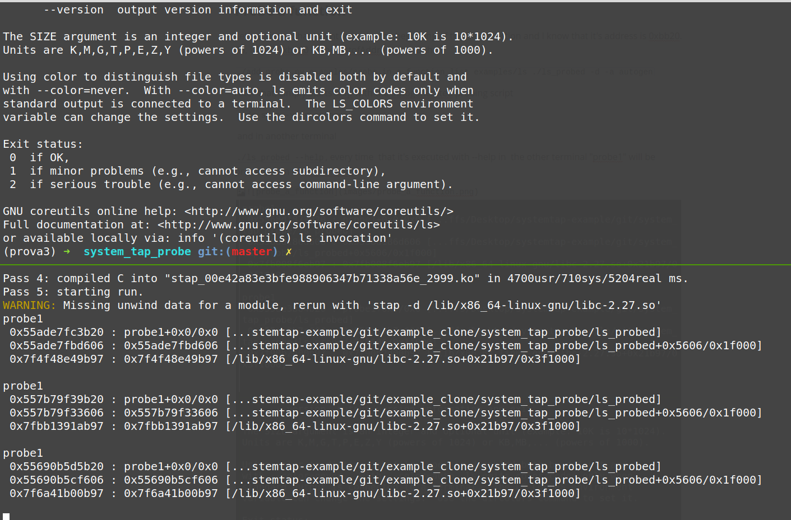

## System tap User Space probes in a compiled binary

## Goal 

The goal is to enable user space probing with system tap but without having access to the source code and to the symbol table. It's assumed that the addresses of the instructions to probe are known.

## Parameters 

A simple invocation can be:

`python add_probe.py listOfAddresses binary new_binary`

listOfAddresses : A file containing the list of addresses that you want probe in the format hex(address) [probe name]  
For position independent code, you have to specify the offset from the beginning of the binary( that is  the address indicated by objdump or radare2), while for position dependent code you have to indicate the virtual address of the instruction.

`BinaryName` The file to probe

`OutputBinaryName` Output file

##### Optional parameters

`-a`, `--autoGeneratedScriptName`  if specified, create a simple system tap script with the specified name that prints the name of the probe whenever it's reached and the backtrace

`-s`,`-section` specify the section to which  the addresses in listOfAddresses, the standard is .text

`-d`,`--debug` enable debug prints

## Examples 

Let's take /bin/sh as a sample binary....

### Probe a function

Let's suppose that I want to probe the beginning of the help function and I know that it's address is 0xbb20,. So, I'll put 0xbb20 in the ListofAddresses and then  

 `./add_probe.py examples/probe_in_a_function examples/ls ./ls_probed -d -a autogen`

After that, simply starts stap with the autogenerated probing script

`sudo stap -v -g autogen `

 and in another terminal

`./ls_probed --help`, every time  that it's executed with --help in  the other terminal "probe1" will be printed, as in the screenshot

### Probe an  instruction

Same as before, the only thing that you have to add the address in the ListOfAddresses file

### Probe the plt 

It's also possible to put a probe in the plt.

` ./add_probe.py examples/probe_plt examples/ls ./ls_probed -d -a autogen -s .plt` 

this time the listOfAddress will contain the line `3cd0 printfplt` referring to the address of the entry of the plt.  The result should be the following:

On the right `sudo stap -v -g autogen ` and on the left `./ls_probed --help`

## How does it work?

In the usual use case, system tap probes are declared as "marks" in the source code with macros in the format  "DTRACE_PROBEN(my_prog,ciao);"  where N stands for the number of arguments to pass to stap script".

Once compiled the mark will become a NOP instruction rounded by 2*N instructions whose task is to  place the parameters for the stap script and restore the status when come back.  So, when stap is probing , the NOP will be replaced by an int3 instruction and when the program reaches the mark the control will go to the kernel. 

On the other hand, the probes created with this tool are slightly different. They are called "function" probes and initially they were intended from system tap  to probe the beginning of a function in  a non-stripped binary.

Taking advantage of them, this tool adds a symbol referring to an arbitrary address of memory  (as it is was  the beginning  of a function)  and then, system tap will take care of the rest.

Notice that with this approach all system tap's power is preserved  but at the same time the binary has not been patched and we avoid to mess something up 
